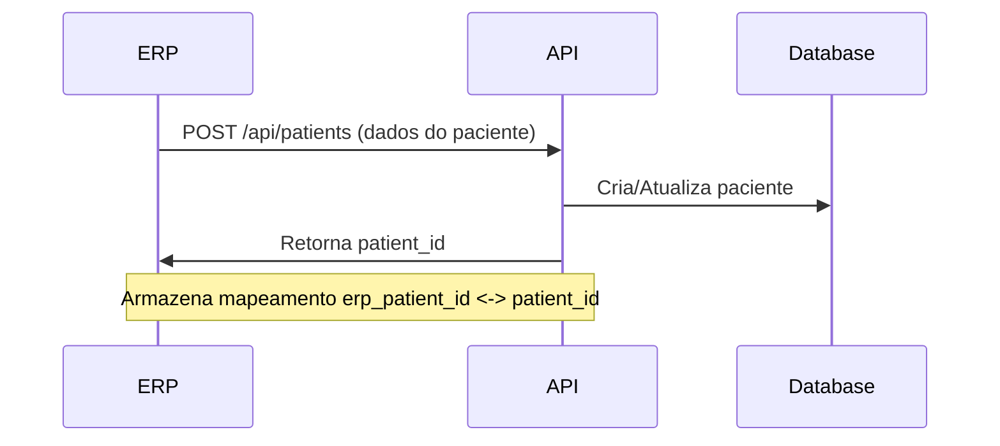
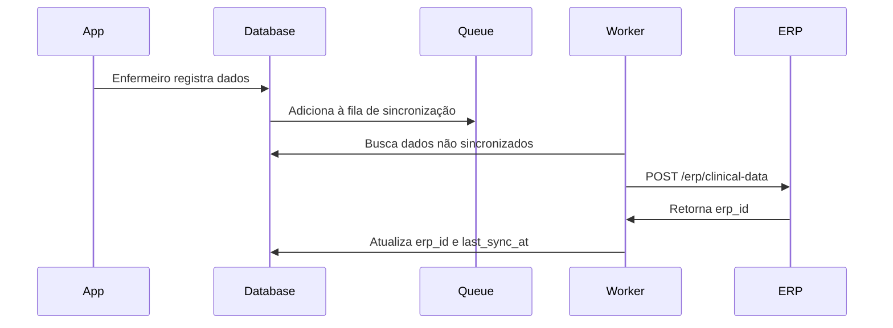

# Documentação API - Módulo de Enfermagem

## Visão Geral

Esta API permite integração entre sistemas ERP hospitalares e o aplicativo AM2, focando no módulo de enfermagem. O fluxo principal é:

- **Cadastro Mestre**: Pacientes são cadastrados no ERP do hospital
- **Sincronização**: Dados dos pacientes são sincronizados para o app
- **Registros**: Enfermeiros registram sinais vitais, procedimentos, evoluções e incidentes no app
- **Integração**: Dados clínicos são enviados de volta ao ERP periodicamente

---

## Autenticação

Todas as requisições devem incluir o token de autenticação no header:

```
Authorization: Bearer {organization_api_token}
```

Para gerar tokens de API, acesse: `/token-generator`

---

## 1. API de Pacientes

### GET /api/patients

Lista todos os pacientes ativos da organização.

**Resposta:**
```json
{
  "success": true,
  "data": [
    {
      "id": "uuid",
      "erp_patient_id": "ERP123456",
      "full_name": "João da Silva",
      "cpf": "12345678900",
      "birth_date": "1980-05-15",
      "gender": "M",
      "bed_number": "203",
      "registry_number": "12345",
      "allergies": ["Penicilina", "Dipirona"],
      "phone": "(11) 98765-4321",
      "email": "joao@email.com",
      "is_active": true,
      "last_sync_at": "2024-11-28T10:30:00Z",
      "created_at": "2024-11-20T08:00:00Z"
    }
  ]
}
```

### POST /api/patients

Cria ou atualiza paciente (sincronização do ERP).

**Requisição:**
```json
{
  "erp_patient_id": "ERP123456",
  "full_name": "João da Silva",
  "cpf": "12345678900",
  "birth_date": "1980-05-15",
  "gender": "M",
  "bed_number": "203",
  "registry_number": "12345",
  "allergies": ["Penicilina"],
  "phone": "(11) 98765-4321",
  "email": "joao@email.com"
}
```

**Resposta:**
```json
{
  "success": true,
  "message": "Paciente sincronizado com sucesso",
  "patient_id": "uuid"
}
```

---

## 2. API de Sinais Vitais

### GET /api/vital-signs

Lista sinais vitais com filtros opcionais.

**Parâmetros:**
- `patient_id` (opcional): ID do paciente
- `start_date` (opcional): Data inicial (ISO 8601)
- `end_date` (opcional): Data final (ISO 8601)
- `is_abnormal` (opcional): true/false

**Resposta:**
```json
{
  "success": true,
  "data": [
    {
      "id": "uuid",
      "patient_id": "uuid",
      "nurse_id": "uuid",
      "erp_id": null,
      "measurement_date": "2024-11-28T14:30:00Z",
      "temperature": 36.5,
      "blood_pressure_systolic": 120,
      "blood_pressure_diastolic": 80,
      "heart_rate": 75,
      "respiratory_rate": 16,
      "oxygen_saturation": 98,
      "pain_scale": 2,
      "is_abnormal": false,
      "notes": "Paciente em bom estado geral",
      "sector": "UTI",
      "last_sync_at": null
    }
  ]
}
```

### POST /api/vital-signs

Registra sinais vitais (usado pelo app).

**Requisição:**
```json
{
  "patient_erp_id": "ERP123456",
  "nurse_erp_id": "NURSE001",
  "temperature": 36.5,
  "blood_pressure_systolic": 120,
  "blood_pressure_diastolic": 80,
  "heart_rate": 75,
  "respiratory_rate": 16,
  "oxygen_saturation": 98,
  "pain_scale": 2,
  "notes": "Paciente em bom estado geral",
  "sector": "UTI"
}
```

**Resposta:**
```json
{
  "success": true,
  "message": "Sinais vitais registrados",
  "vital_signs_id": "uuid"
}
```

---

## 3. API de Procedimentos

### GET /api/procedures

Lista procedimentos de enfermagem.

**Parâmetros:**
- `patient_id` (opcional)
- `start_date` (opcional)
- `end_date` (opcional)
- `procedure_type` (opcional)

**Resposta:**
```json
{
  "success": true,
  "data": [
    {
      "id": "uuid",
      "patient_id": "uuid",
      "nurse_id": "uuid",
      "erp_id": null,
      "procedure_date": "2024-11-28T15:00:00Z",
      "procedure_type": "curativo",
      "description": "Curativo em ferida operatória",
      "location": "Abdômen",
      "observations": "Ferida limpa, sem sinais de infecção",
      "digital_signature": "base64_signature_data",
      "sector": "Clínica Cirúrgica",
      "last_sync_at": null
    }
  ]
}
```

### POST /api/procedures

Registra procedimento de enfermagem.

**Requisição:**
```json
{
  "patient_erp_id": "ERP123456",
  "nurse_erp_id": "NURSE001",
  "procedure_type": "curativo",
  "description": "Curativo em ferida operatória",
  "location": "Abdômen",
  "observations": "Ferida limpa, sem sinais de infecção",
  "digital_signature": "base64_signature_data",
  "sector": "Clínica Cirúrgica"
}
```

**Tipos de Procedimentos:**
- `medication` - Administração de medicação
- `curativo` - Curativos
- `higiene` - Higiene e conforto
- `sonda` - Sondagem
- `aspiracao` - Aspiração
- `coleta` - Coleta de exames
- `outros` - Outros procedimentos

---

## 4. API de Incidentes

### GET /api/incidents

Lista incidentes/intercorrências.

**Parâmetros:**
- `patient_id` (opcional)
- `severity` (opcional): low, medium, high, critical
- `resolved` (opcional): true/false

**Resposta:**
```json
{
  "success": true,
  "data": [
    {
      "id": "uuid",
      "patient_id": "uuid",
      "reported_by": "uuid",
      "erp_id": null,
      "incident_date": "2024-11-28T16:30:00Z",
      "incident_type": "medication_error",
      "severity": "medium",
      "description": "Medicação administrada com 30 minutos de atraso",
      "actions_taken": "Comunicado ao médico, paciente monitorado",
      "resolved": true,
      "resolved_at": "2024-11-28T17:00:00Z",
      "sector": "Enfermaria A",
      "last_sync_at": null
    }
  ]
}
```

### POST /api/incidents

Registra incidente/intercorrência.

**Requisição:**
```json
{
  "patient_erp_id": "ERP123456",
  "nurse_erp_id": "NURSE001",
  "incident_type": "medication_error",
  "severity": "medium",
  "description": "Medicação administrada com 30 minutos de atraso",
  "actions_taken": "Comunicado ao médico, paciente monitorado",
  "sector": "Enfermaria A"
}
```

**Tipos de Incidentes:**
- `medication_error` - Erro de medicação
- `fall` - Queda
- `pressure_ulcer` - Lesão por pressão
- `infection` - Infecção
- `equipment_failure` - Falha de equipamento
- `adverse_reaction` - Reação adversa
- `outros` - Outros

**Níveis de Severidade:**
- `low` - Baixo (sem dano ao paciente)
- `medium` - Médio (dano mínimo, sem sequelas)
- `high` - Alto (dano moderado, possíveis sequelas)
- `critical` - Crítico (dano grave ou morte)

---

## 5. API de Evoluções de Enfermagem

### GET /api/nursing-reports

Lista evoluções de enfermagem.

**Parâmetros:**
- `patient_id` (opcional)
- `start_date` (opcional)
- `end_date` (opcional)
- `evolution_type` (opcional)

**Resposta:**
```json
{
  "success": true,
  "data": [
    {
      "id": "uuid",
      "patient_id": "uuid",
      "nurse_id": "uuid",
      "erp_id": null,
      "evolution_date": "2024-11-28T18:00:00Z",
      "evolution_type": "daily",
      "subjective_data": "Paciente relata dor leve no local da incisão",
      "objective_data": "PA 120/80, FC 75, Tax 36.5°C, ferida limpa e seca",
      "assessment": "Paciente em recuperação pós-operatória estável",
      "plan": "Manter curativos, controlar sinais vitais 6/6h, analgesia conforme prescrição",
      "sector": "Clínica Cirúrgica",
      "ai_suggestions": "Sugestão: Considerar deambulação precoce",
      "last_sync_at": null
    }
  ]
}
```

### POST /api/nursing-reports

Registra evolução de enfermagem (método SOAP).

**Requisição:**
```json
{
  "patient_erp_id": "ERP123456",
  "nurse_erp_id": "NURSE001",
  "evolution_type": "daily",
  "subjective_data": "Paciente relata dor leve no local da incisão",
  "objective_data": "PA 120/80, FC 75, Tax 36.5°C, ferida limpa e seca",
  "assessment": "Paciente em recuperação pós-operatória estável",
  "plan": "Manter curativos, controlar sinais vitais 6/6h",
  "sector": "Clínica Cirúrgica"
}
```

**Tipos de Evolução:**
- `admission` - Admissão
- `daily` - Evolução diária
- `discharge` - Alta
- `intercurrence` - Intercorrência
- `transfer` - Transferência

---

## Fluxo de Sincronização com ERP

### 1. Sincronização de Pacientes (ERP → App)



**Recomendações:**
- Executar sincronização a cada 15 minutos ou em tempo real (webhook)
- Incluir campo `last_sync_at` para controle
- Usar `erp_patient_id` como chave de identificação única

### 2. Envio de Dados Clínicos (App → ERP)



**Recomendações:**
- Sincronização assíncrona a cada 5-10 minutos
- Retry automático em caso de falha (3 tentativas)
- Manter dados localmente até confirmação de sincronização
- Log detalhado de todas as sincronizações

### 3. Modelo de Payload de Sincronização em Lote

```json
{
  "sync_timestamp": "2024-11-28T20:00:00Z",
  "organization_id": "ORG123",
  "data": {
    "vital_signs": [...],
    "procedures": [...],
    "incidents": [...],
    "nursing_reports": [...]
  }
}
```

---

## Códigos de Status HTTP

- `200 OK` - Requisição bem-sucedida
- `201 Created` - Recurso criado com sucesso
- `400 Bad Request` - Dados inválidos
- `401 Unauthorized` - Token inválido ou ausente
- `403 Forbidden` - Sem permissão para acessar recurso
- `404 Not Found` - Recurso não encontrado
- `409 Conflict` - Conflito de dados (ex: paciente já existe)
- `500 Internal Server Error` - Erro no servidor

---

## Exemplo de Integração

### JavaScript/Node.js

```javascript
const axios = require('axios');

const API_URL = 'https://seu-dominio.com/api';
const API_TOKEN = 'seu_token_aqui';

// Sincronizar paciente do ERP
async function syncPatient(patientData) {
  try {
    const response = await axios.post(`${API_URL}/patients`, patientData, {
      headers: {
        'Authorization': `Bearer ${API_TOKEN}`,
        'Content-Type': 'application/json'
      }
    });
    console.log('Paciente sincronizado:', response.data);
    return response.data.patient_id;
  } catch (error) {
    console.error('Erro ao sincronizar:', error.response.data);
    throw error;
  }
}

// Buscar sinais vitais para sincronizar com ERP
async function fetchVitalSigns(patientId, startDate) {
  try {
    const response = await axios.get(`${API_URL}/vital-signs`, {
      params: { patient_id: patientId, start_date: startDate },
      headers: { 'Authorization': `Bearer ${API_TOKEN}` }
    });
    return response.data.data;
  } catch (error) {
    console.error('Erro ao buscar dados:', error);
    throw error;
  }
}
```

---

## Webhooks (Opcional)

O sistema pode enviar webhooks para notificar o ERP sobre eventos importantes:

### Eventos Disponíveis

- `patient.admitted` - Paciente admitido
- `vital_signs.abnormal` - Sinais vitais anormais detectados
- `incident.created` - Incidente registrado
- `patient.discharged` - Paciente recebeu alta

### Formato do Webhook

```json
{
  "event": "vital_signs.abnormal",
  "timestamp": "2024-11-28T20:30:00Z",
  "data": {
    "patient_id": "uuid",
    "erp_patient_id": "ERP123456",
    "vital_signs": {...}
  }
}
```

---

## Suporte

Para dúvidas ou problemas com a integração:
- Email: suporte@am2app.com
- Documentação completa: https://docs.am2app.com
- Status da API: https://status.am2app.com
